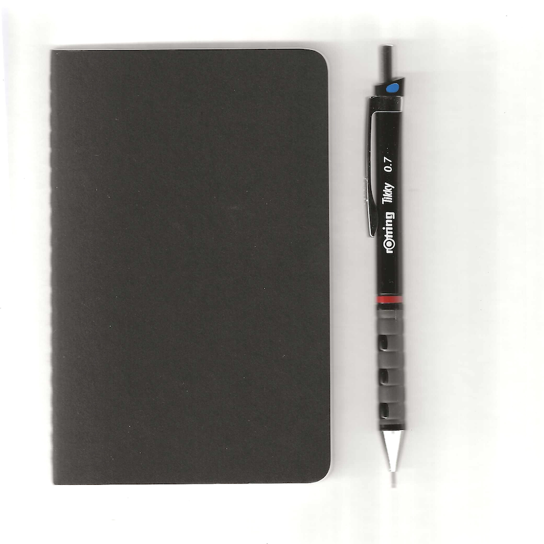

Capturar figuras e rostos num pequeno caderno Moleskine.

- [01](Moleskine-01.md)
- [02](Moleskine-02.md)
- [03](Moleskine-03.md)
- [04](Moleskine-04.md)
- [05](Moleskine-05.md)
- [06](Moleskine-06.md)
- [07](Moleskine-07.md)
- [08](Moleskine-08.md)
- [09](Moleskine-09.md)
- [10](Moleskine-10.md)
