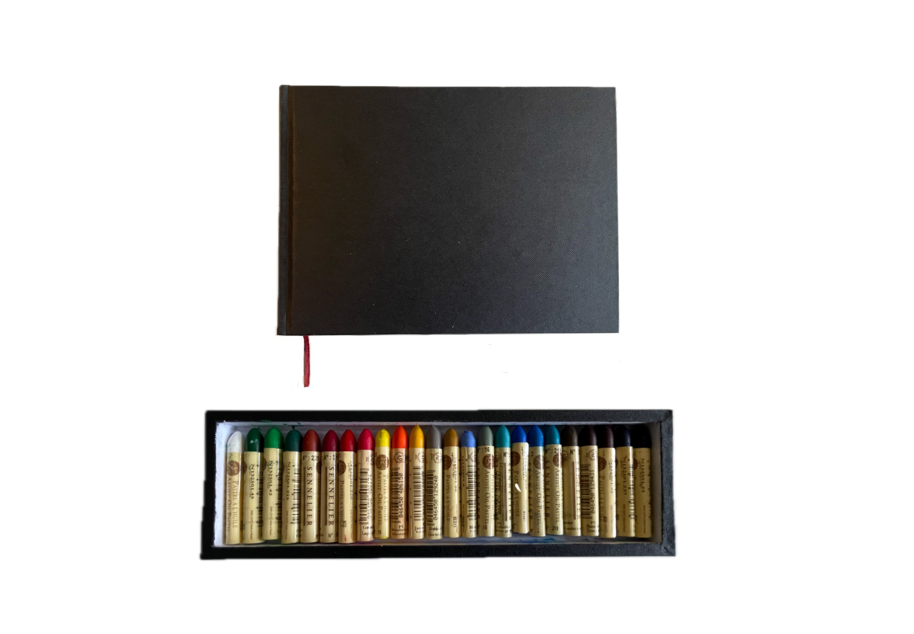

Manchas de cor ou cor sólida, qual é que vai ganhar? No verão, derretem como gelados.

- [01](Pastel-a-oleo-01.md)
- [02](Pastel-a-oleo-02.md)
- [03](Pastel-a-oleo-03.md)
- [04](Pastel-a-oleo-04.md)
- [05](Pastel-a-oleo-05.md)
- [06](Pastel-a-oleo-06.md)
- [07](Pastel-a-oleo-07.md)
- [08](Pastel-a-oleo-08.md)
- [09](Pastel-a-oleo-09.md)
