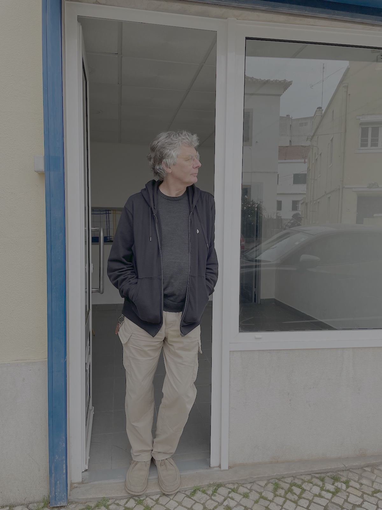

> Quando se ia embora, alguns deles disseram-lhe: "Não é preciso falar de nós aos de fora".

O meu pai gostava de pintar. Tinha livros de arte em casa. O Gauguin era o meu favorito. _Bonjour, Monsieur Gauguin._ Pinturas num lugar novo. Le Pouldu até Hiva Oa. 

Lisboa é o meu Tahiti. Areias cor-de-rosa e sombras azuis. Já saudâmos Alhandra, a toireira. Uma brecha até ao século XIX. 

A gigantesca fábrica da Cimpor, o grupo de jogadores de cartas no café dos columbófilos, as ruas quase desertas ao meio-dia, os graffitis dos jovens anarquistas, um desfile de palmeiras, e os camiões sem fim.

Sair do comboio é como chegar à _[Fonte da Flor de Pêssego](https://en.wikipedia.org/wiki/The_Peach_Blossom_Spring)_.

Vou pintar vinte e quatro quadros.
